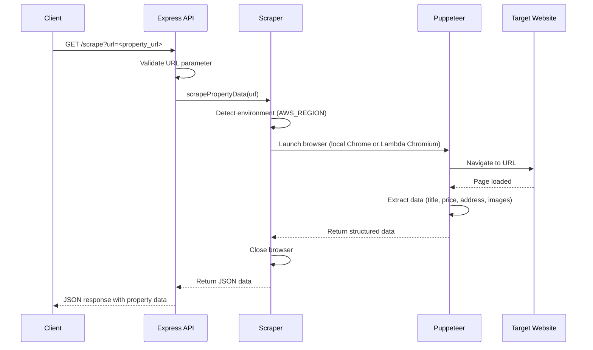

# Real Estate Property Scraper API


A lightweight Node.js + Express API that scrapes real estate listing pages and returns structured property data (title, description, price, address, images) using Puppeteer. It's built to run locally using a locally installed Chrome binary and can also run in AWS Lambda environments using a Lambda-optimized Chromium build.

## Features

- RESTful API endpoint for scraping property detail pages
- Extracts: title, description, price, address, and images
- Supports both local development and AWS Lambda deployment (automatic environment detection)
- CORS enabled for cross-origin requests
- Filters out non-relevant images (SVGs, logos) and returns an array of image URLs

## Prerequisites

- Node.js 14+ (recommended)
- npm or yarn
- Google Chrome installed locally (for local development)
- AWS account (if deploying to Lambda)

## Installation

1. Clone the repository:

```bash
git clone https://github.com/haseeb3294/realestate-scraper.git
cd realestate-scraper
```

2. Install dependencies:

```bash
npm install
```

This will install the packages listed in `package.json`. Key packages include:

- `express`: Web framework used to serve the API
- `cors`: Enables Cross-Origin Resource Sharing
- `puppeteer-core`: Controls Chromium/Chrome without bundling a browser binary
- `@sparticuz/chromium`: Provides a Lambda-friendly Chromium binary and args
- (Optional) `puppeteer`: for setups that prefer a bundled browser binary

> Note: The repository includes `puppeteer-core` and `@sparticuz/chromium` so the code can use a system Chrome for local development and a Lambda-optimized Chromium when `AWS_REGION` is set. Some developers also include `puppeteer` (bundled Chromium) for local convenience; this project prefers `puppeteer-core` to reduce package size.

## Local Development

- Ensure Chrome is installed locally. The scraper uses a hard-coded path in `scraper.js` for the Chrome executable in local mode—adjust it if Chrome is in a different location on your machine.
- Optional: set the `PORT` environment variable (defaults to `5000`).

Start the server:

```bash
node index.js
```

You should see a console message confirming the server is listening on the configured port (e.g. `Server running on port 5000`).

## AWS Lambda Deployment

- The scraper detects Lambda by checking the `AWS_REGION` environment variable. When present, the code uses `@sparticuz/chromium` to obtain a Lambda-compatible Chromium executable and launch arguments.
- Lambda packaging: include `node_modules` and ensure the Chromium binary and dependencies are present. You can also provide Chromium as a Lambda layer.
- Lambda-friendly launch options and viewport are set inside `scraper.js`, and a longer timeout is recommended when running on Lambda.

## Live Deployment

This project is deployed on Vercel and available at:

```
https://realestate-scraper.vercel.app/
```

## API Endpoints

### Root (Health check)

- Method: GET
- Path: `/`
- Response: simple JSON or text indicating the service is up.

Example success response:

```json
{ "status": "ok", "message": "Real Estate Property Scraper running" }
```

### Scrape

- Method: GET
- Path: `/scrape`
- Query Parameters:

  - `url` (required): full property listing URL to scrape

- Responses:
  - 200: JSON with scraped property data
  - 400: Missing/invalid `url` parameter
  - 500: Scraping failure or internal error

Example error (missing URL):

```json
{ "error": "Missing required query parameter: url" }
```

## Example Usage

cURL example:

```bash
curl "http://localhost:5000/scrape?url=https://example.com/property/123"
```

Browser URL example:

```
http://localhost:5000/scrape?url=https://example.com/property/123
```

JavaScript (fetch) example:

```js
fetch("/scrape?url=https://example.com/property/123")
  .then((res) => res.json())
  .then((data) => console.log(data));
```

### Example Success Response

```json
{
  "url": "https://example.com/property/123",
  "title": "Beautiful 3-bedroom home with garden",
  "description": "A bright and spacious 3-bedroom house located close to parks and transit.",
  "price": "$450,000",
  "address": "123 Main St, Hometown, HT 12345",
  "images": [
    "https://example.com/images/property123-1.jpg",
    "https://example.com/images/property123-2.jpg"
  ]
}
```

### Example Error Response (scrape failure)

```json
{ "error": "Failed to scrape the provided URL" }
```

## How It Works

1. The Express API receives a GET request at `/scrape?url=...`.
2. The server validates the `url` parameter.
3. The scraper module detects environment (local vs AWS Lambda). If `AWS_REGION` is set, it selects `@sparticuz/chromium`; otherwise it uses a local Chrome executable path.
4. Puppeteer launches a headless browser and navigates to the URL with `networkidle2`.
5. The page is evaluated to extract fields (title, description, price, address, images) using a set of selectors. Multiple selector patterns are tried to improve robustness across sites.
6. Images are filtered to remove SVGs, small logos, or obvious non-property assets.
7. The browser is closed and structured data is returned as JSON.

The repository's `index.js` wires the Express routes and `scraper.js` contains the Puppeteer scraping logic.

## Configuration

- Chrome executable path: adjust for local development in `scraper.js` if your Chrome is installed in a different location.
- PORT: set `PORT` env var to override the default (5000).
- Request timeout: currently set to 60000ms (1 minute) inside the scraper; you can adjust a constant if needed for slow pages.
- Selector patterns: `scraper.js` includes multiple selectors for title, price, and address—change or extend them to support more listing sites.

## Limitations & Notes

- Scraping relies on the structure of the target website; if the site changes, selectors may need updates.
- Some websites actively block automated scraping or require authentication—this tool doesn't bypass legal protections.
- Respect robots.txt and the target website's terms of service.
- Consider rate limiting requests and caching results for production use.

## Troubleshooting

- "Chrome executable not found": ensure Chrome is installed and update the executable path in `scraper.js`.
- Timeouts: try increasing the timeout value or ensure the target page fully loads.
- Empty data returned: the page structure may not match the selectors—inspect the page and update selectors accordingly.
- CORS issues: the API enables CORS, but if you proxy requests or deploy behind another service, ensure CORS headers are preserved.

## Mermaid Sequence Diagram



## License & Author

- License: ISC (see `package.json`)
- Author: haseeb3294

If you'd like the README to include additional examples for a particular real estate website or to include deployment scripts (SAM, Serverless Framework, or Terraform) for Lambda, tell me which you'd prefer and I can extend the docs.
